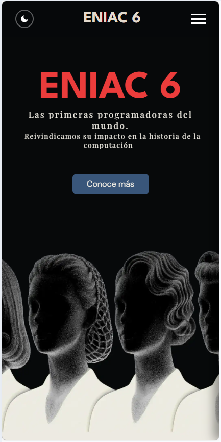
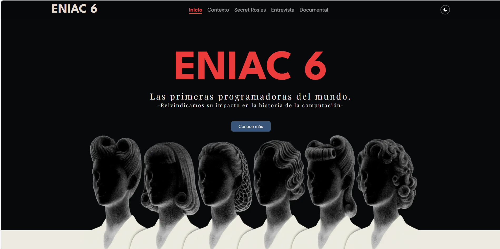
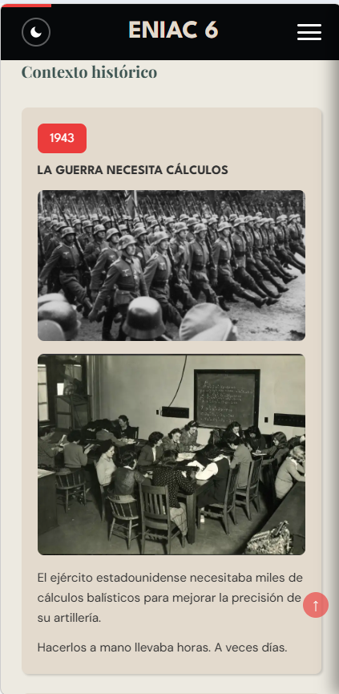
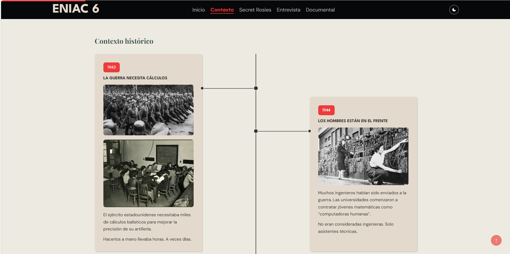
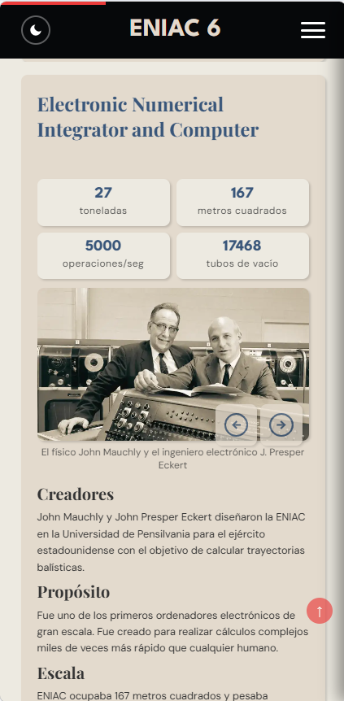
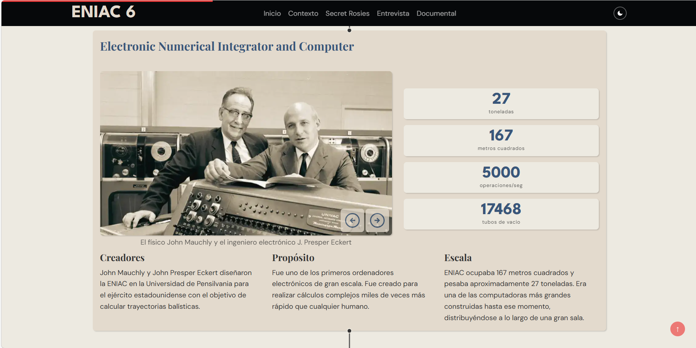
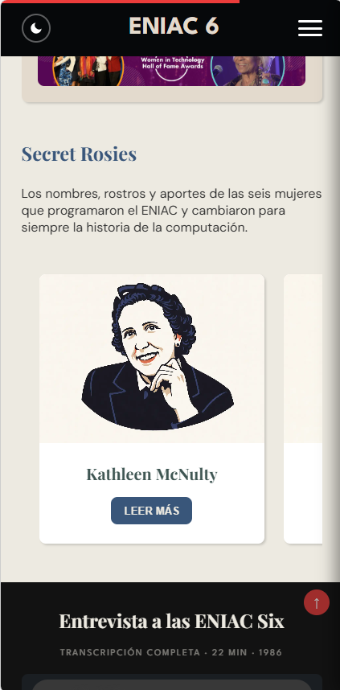
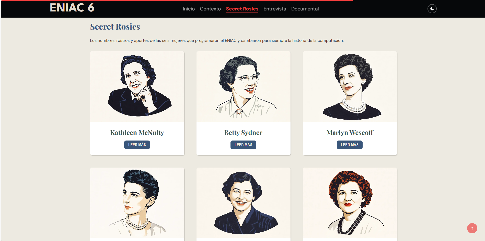
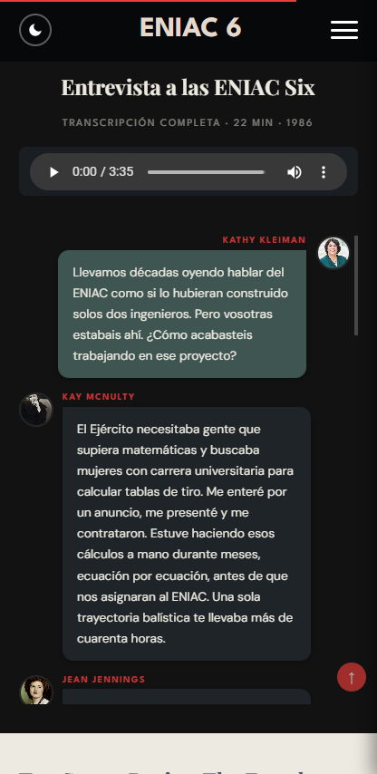
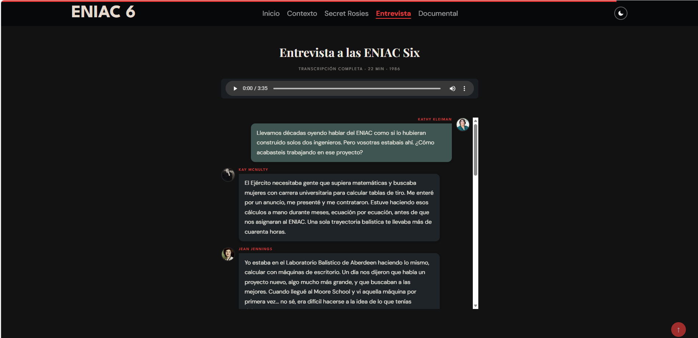

# 💻 Arquitectas del Ciberespacio — ENIAC Six

Proyecto web responsive desarrollado como ejercicio de maquetación avanzada utilizando **HTML, CSS y JavaScript**.

---

# 📌 Descripción

**Arquitectas del Ciberespacio** es una web divulgativa sobre las **ENIAC Six**, el grupo de seis mujeres matemáticas que programaron el **ENIAC**, uno de los primeros ordenadores electrónicos de la historia.

El proyecto contextualiza el momento histórico en el que se desarrolló esta máquina durante la **Segunda Guerra Mundial** y explica cómo estas programadoras desarrollaron algunos de los primeros métodos de programación informática.

Además de explicar el funcionamiento del ENIAC, la web aborda el problema de la **invisibilización histórica de las mujeres en la tecnología**, mostrando cómo su trabajo fue ignorado durante décadas.

La web está diseñada como una **one-page interactiva**, combinando narrativa histórica, diseño editorial e ilustración inspirada en la estética gráfica de los años 40.

---

# 🎯 Objetivos del proyecto

- Construir una **web completamente responsive**.
- Explicar el contexto histórico del **ENIAC y las ENIAC Six**.
- Aplicar buenas prácticas de **HTML semántico**.
- Utilizar **CSS moderno para layouts complejos**.
- Integrar contenido histórico con una **estética visual coherente con la época**.
- Desarrollar una **one-page con navegación fluida entre secciones**.

---

# 🛠 Tecnologías utilizadas

- **HTML5**

  - estructura semántica del documento
- **CSS3**

  - Flexbox
  - CSS Grid
  - Scroll Snap
  - clamp()
  - Transiciones y transformaciones
- **JavaScript**

  - pequeñas interacciones
  - control de algunos elementos dinámicos
- **Figma**

  - prototipo visual y diseño previo
- **Git & GitHub**

  - control de versiones
  - trabajo colaborativo con ramas

---

# 📂 Estructura del proyecto

arquitectas-ciberespacio
│
├── index.html
├── css/
│ └── styles.css
├── js/
│ └── script.js
├── assets/
│ ├── images/
│ ├── illustrations/
│ └── icons/
└── README.md

**Explicación de la organización:**

- **index.html**estructura principal de la web.
- **css/**hojas de estilo del proyecto.
- **js/**scripts para pequeñas funcionalidades interactivas.
- **assets/**
  recursos gráficos utilizados en la web.

---

# 📱 Responsive Design

El proyecto se ha desarrollado siguiendo un enfoque **Mobile First**.

**Breakpoints principales:**

- Mobile → diseño base
- Tablet → reorganización del layout
- Desktop → ampliación del grid y distribución avanzada

Para garantizar la escalabilidad se utilizan:

- unidades relativas (`rem`, `%`, `vw`)
- tipografía fluida mediante **clamp()**
- layouts adaptativos con **Grid y Flexbox**

---

# 🧠 Arquitectura del proyecto

El proyecto se planteó como una **experiencia narrativa interactiva**, donde el usuario recorre la historia de las ENIAC Six de forma progresiva a través del scroll.

---

## One-page como estructura principal

Se optó por desarrollar la web como **one-page** en lugar de un sitio multipágina.

Esto permite que la narrativa funcione como un **recorrido cronológico continuo**, guiando al usuario desde el contexto histórico hasta la presentación de las programadoras.

Las ventajas de este enfoque son:

- experiencia de lectura más fluida
- continuidad narrativa
- navegación sencilla
- mejor adaptación al consumo en dispositivos móviles

Cada sección funciona como un **capítulo de la historia**.

---

## Uso de Scroll Snap

Se utilizó **CSS Scroll Snap** para mejorar la experiencia de navegación.

Esta técnica permite que cada sección se **alineé automáticamente en pantalla al hacer scroll**, evitando posiciones intermedias.

Ventajas de esta decisión:

- mejora la navegación
- refuerza la estructura narrativa
- permite que cada sección se perciba como un bloque independiente

---

## Uso de un Timeline para el contexto histórico

El contexto histórico se presenta mediante un **timeline**.

Este componente permite explicar de forma clara y visual:

- el contexto de la Segunda Guerra Mundial
- el desarrollo del proyecto ENIAC
- el papel de las mujeres en el proyecto

El timeline aporta dinamismo visual y facilita la comprensión cronológica de los acontecimientos.

---

# 🎨 Diseño visual

La identidad visual del proyecto está inspirada en la **estética editorial de revistas y carteles de los años 40**.

Durante esta década la fotografía era mayoritariamente en blanco y negro, mientras que la publicidad utilizaba ilustraciones con colores vibrantes para atraer la atención del público.

La web combina:

- fotografías históricas
- ilustración editorial
- composiciones inspiradas en revistas

El objetivo es reforzar el contexto histórico del proyecto a través del diseño.

---

## Tipografía

Tipografías utilizadas en el proyecto:

- **Playfair Display** → títulos principales
- **League Spartan** → encabezados destacados
- **DM Sans** → textos de lectura

Esta combinación permite mantener una estética editorial manteniendo buena legibilidad.

---

## Paleta de colores

**Colores principales**
#3d5552
#37557b
#ef4035

**Colores secundarios**

#edeae1
#f5f5f5
#e3dacc
#333333

**background**

#edeae1;
#06080a;

La paleta está inspirada en la ilustración y la publicidad gráfica de mediados del siglo XX.

---

# 🧭 Estructura de la web

La web está organizada como una **one-page con scroll vertical**.

### Hero

Introducción al proyecto y presentación del tema.

### Contexto histórico

Timeline sobre el contexto de la Segunda Guerra Mundial y el desarrollo del ENIAC.

### Proyecto ENIAC

Explicación del funcionamiento del ENIAC y su uso en cálculos militares.

### Invisibilización

Reflexión sobre la invisibilización histórica de las programadoras.

### Las seis programadoras

Presentación de las **ENIAC Six**.

### Entrevista

Sección interactiva basada en preguntas y respuestas.

### Documental

Sección donde se puede acceder al documental de Secret Rosies para darlas a conocer.

---

## Secciones previstas (en desarrollo)

Las siguientes secciones forman parte del planteamiento del proyecto pero **no están implementadas todavía**:

- Impacto militar vs tecnológico
- Legado tecnológico

Estas secciones ampliarán la reflexión sobre el impacto del ENIAC en el desarrollo de la informática moderna.

---

# ⚠️ Retos encontrados

Durante el desarrollo del proyecto surgieron varios retos:

- adaptar el **timeline** para que funcionara correctamente en móvil
- mantener una estética editorial compleja sin perder legibilidad
- coordinar el trabajo del equipo mediante **ramas de Git**
- integrar secciones desarrolladas por diferentes miembros del grupo

Estos retos ayudaron a mejorar la organización del proyecto y el trabajo colaborativo.

---

# 🚀 Mejoras futuras

Posibles mejoras del proyecto:

- completar las secciones de **impacto y legado tecnológico**
- mejorar la accesibilidad (ARIA y navegación por teclado)
- optimizar imágenes para mejorar rendimiento
- añadir más interacciones con JavaScript

---

# 📸 Capturas del proyecto

### Hero

### Contexto histórico (timeline)

### Proyecto ENIAC

### Las seis programadoras

### Entrevista

### documental  y footer

# 🔗 Demo

El proyecto podrá visualizarse mediante **GitHub Pages** una vez finalizado.

---

# 👨‍💻 Autores

Proyecto realizado por:

- Marta
- Jose
- Germán
- Ingrid
- Uri

Curso: **Confección y Publicación de Páginas Web**
CIFO Barcelona La Violeta
2026

---

# 📊 Validación

- HTML validado con W3C ✔
- CSS validado ✔
- Lighthouse Performance: 97
- Lighthouse Accessibility: 100
- Best practices: 96
- CEO: 100

---
